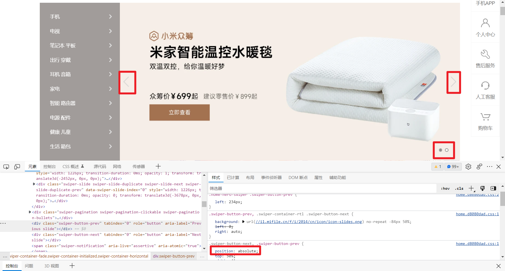
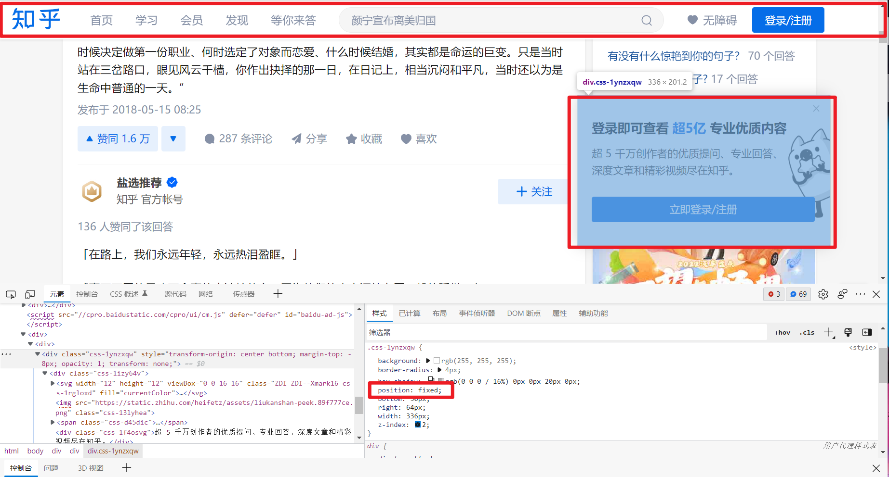
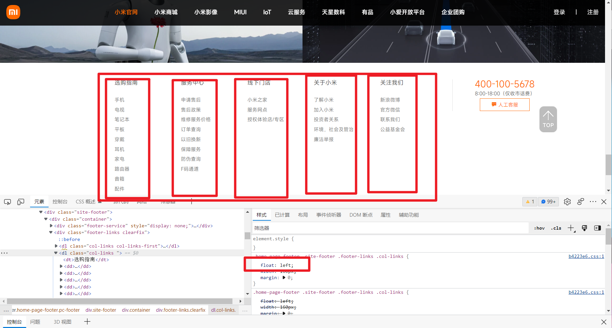
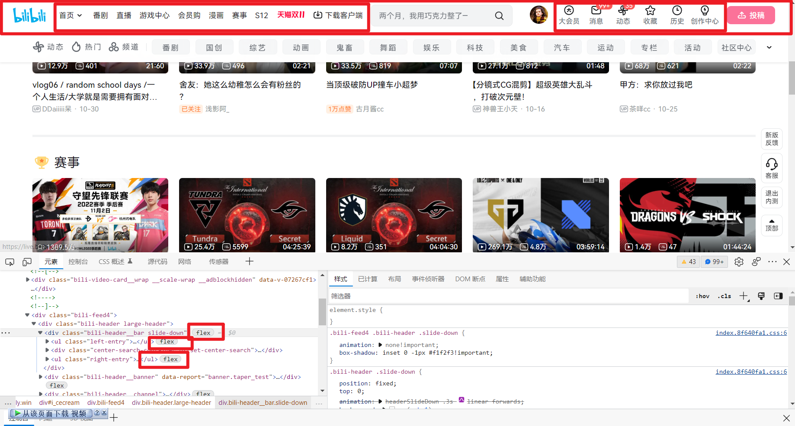
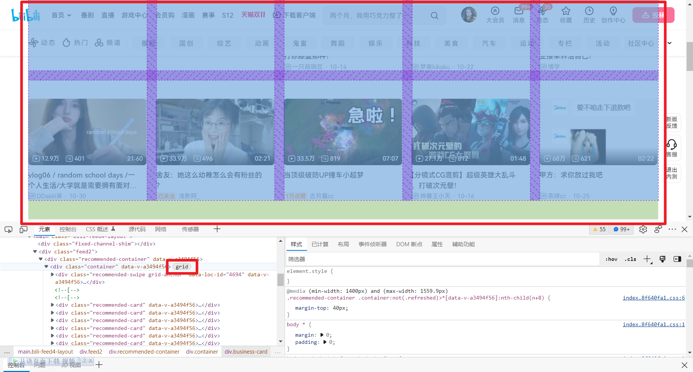
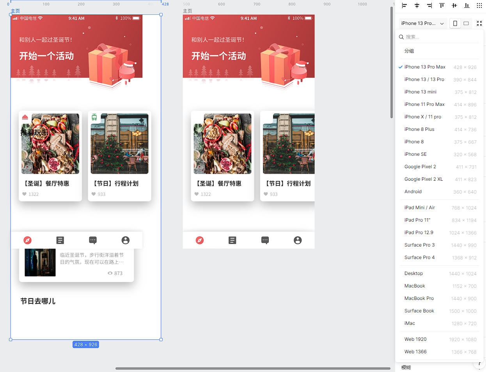

## StarStudio前端招新题目

### HTML和CSS思考题

#### 1. CSS有众多的选择器，什么时候应该用怎样的选择器才能让代码更加简洁？

CSS中有着数量众多的选择器，针对不同的需求如何挑选恰当的选择器，我觉得最重要的一点就是要理解**常见选择器的特点**.

比方说在某个页面中经常用到一个背景颜色`#135ce0`,那我们就可以用一个类名来代表这个颜色,并用类名选择器为这个类名添加`background-color:#135ce0`,此后用到该颜色的地方只需在标签中加上这个类名即可，不必单独再写一个选择器去改变它的颜色。

这里我根据自己的经验，总结了一些常见的应用场景，如有不妥之处，还请多指教。

对于**基础选择器**：

+ 类选择器：将复用次数较多的相同属性拿出来单独作为一个类，以后使用时，只需赋予标签该类名即可。例如我们经常写`w {width:1200px;}`这样一句话来作为版心宽度.
+ id选择器：id是唯一的，只能对应于文档中某一个具体的元素，利用这个特性可以实现精准的选择.
+ 通配符选择器：1.为了清除默认内外边距对布局的影响，我们通常会写`* {margin:0;padding:0;}`;2.选择某一元素中的所有元素,可以采用类似`p *`的写法,其意义是选择在`<p>`里的所有元素。
+ 并集选择器：可以同时选择多种标签,用`,`间隔.
+ 类名相同,但标签不同时,可以采用类似`div.nav`的写法,其意义是选择具有`nav`类名的`div`标签.

对于**高级选择器**：

+ 灵活使用`nth-child(A)`和`nth-of-type(A)`这两个选择器,其中后者可以指定选择儿子的类型.$A$是一个以$n$为自变量的函数,借助$A$我们可以实现很多操作，比方说`2n`可以选择偶数位的元素,`n+5`可以选择第五个开始的元素,`-n+5`可以选择前五个.该特性我经常用于选择`li`(当我用宽度为0的li实现间隔小竖线时).
+ 对于命名有规律的元素，可以考虑使用属性选择器。


|    选择符     | 描述                                  |
| :-----------: | ------------------------------------- |
|    E[att]     | 选择具有att属性的E元素                |
| E[att="val"]  | 选择att属性为val的E元素               |
| E[att^="val"] | 选择具有att属性,且值以val开头的E元素  |
| E[att$="val"] | 选择具有att属性，且值以val结尾的E元素 |
| E[att*="val"] | 选择具有att属性,且值包含val的E元素    |

例如,网页中的部分图片需要设置固定宽高,他们的id是`box-bg1`,`box-bg2`...我们就可以用`img[id^="box-bg"]`帮我们快速选出来。

当然，还有一些**特殊的选择器**也值得记住:

+ `:empty`选择内部为空的元素.

+ `:not(X)`选择除`X`外的其他元素,`X`是其他选择器.例如`:not(.big .medium)`,选择不具有`class="big"`或者`class="medium"`的元素.
+ 使用`::befor`和`::after`来快速完成``iconfont`的布局.

Tips:可以去[CSS Diner - Where we feast on CSS Selectors! (flukeout.github.io)](https://flukeout.github.io/)网站练习一下哦.

#### 2. 有哪些元素居中方法，他们分别适用于怎样的场景？

**水平居中**:

+ 块级元素:`margin:0 auto;`

+ 行内元素或行内块元素:父级元素设置`text-align:center;`

+ 绝对定位实现:（基本思路是先向右移动父元素的50%,再向左移动自己的50%）

```css
div {
    position:absolute;
    left:50%；
    transform: translateX(-50%);
}
```

+ 弹性定位实现:`display: flex;justify-items: center;`

**垂直居中**:

+ 单行文本:元素的高度和行高相等时,文本呈现垂直居中,即`height == line-height`.
+ 多行文本:

  + 不固定高度:使用`padding`撑开盒子
+ 固定高度:`display: table-cell; vertical-align: middle;`
+ 块级元素：使用绝对定位实现,方法类似水平居中,`top:50%;transform:translateY(-50%)；`
+ 弹性定位实现:`display: flex;align-items: center;`

#### 3. CSS有哪些方法可以进行网页布局，请举例说明？

1. **传统方式**：标准流，定位(`position`)，浮动`float`.

**标准流**，是在你没有改变默认布局规则情况下的页面元素布局方式，其规则是：块级元素独占一行，从上到下排列；行内(块)元素共享一行，从左到右排列.该方式经常用于元素的**垂直**布局当中.例如下方图片中的红框部分。


**定位**，由于标准流不够灵活，就有了定位，定位种类较多，这里只给出相应例子，不做详细解释。

对于`absolute`和`relative`:常用于logo或是其他小图片的定位.例如下图红框部分.



对于`fixed`:通常用于页面下滑后，顶部导航栏的固定,侧边广告固定等等.



对于`sticky`:类似与`fixed`,在此就不举例了.

**浮动**, 最初浮动的引入是为了图文环绕排列,后面渐渐成为了**水平**方向布局的重要方式之一.例如下图中的红框部分.



2. **新兴方式**：`flex`弹性区块和`grid`网格.

对于**弹性区块**:`flex`是一种用于按行或按列布局元素的一维布局方法。元素可以膨胀以填充额外的空间，收缩以适应更小的空间。例如下图



对于**网格**:`grid`是一个用于 web 的二维布局系统。利用网格，你可以把内容按照行与列的格式进行排版。另外，网格还能非常轻松地实现一些复杂的布局。对于这种布局方式,本人只是略有耳闻未尝实践.例如下图



#### 4. 为什么要对不同分辨率手机进行适配？常见的适配方案有哪些？

在做原型设计时，设计师通常会选取某一型号的手机进行设计，假如此时我选择了iPhone8(375✖667)进行设计，如果没有对不同分辨率的手机进行适配，直接用iPhone13ProMax(428✖926)去浏览,就会出现类似下图的情况。



从图中最右侧那一栏我们可以看到，不同的设备具有不一样的分辨率，如果我们不对他们进行适配，那么这些设备的用户体验就会非常糟糕，所以我们要对不同分辨率手机进行适配。

**常见的适配方法**：

+ 媒体查询+`rem`搭配使用

```css
html{font-size:10px}
@media screen and (min-width:321px) and (max-width:375px){html{font-size:11px}}
@media screen and (min-width:376px) and (max-width:414px){html{font-size:12px}}
@media screen and (min-width:415px) and (max-width:639px){html{font-size:15px}}
@media screen and (min-width:640px) and (max-width:719px){html{font-size:20px}}
@media screen and (min-width:720px) and (max-width:749px){html{font-size:22.5px}}
@media screen and (min-width:750px) and (max-width:799px){html{font-size:23.5px}}
@media screen and (min-width:800px){html{font-size:25px}}
```

+ 百分比: 通过对属性设置百分比来适应不同的屏幕,有父元素继承或相对父元素，无父元素相对于视窗.
+ Viewport方案: 类似于rem和em,相对屏幕宽高改变，使用`vw`和`vh`设置属性.但是注意在移动端==手机宽度不等于viewport宽度==
+ flex布局: 绝大多数情况下的响应式布局，尤其是全屏布局、两列布局、内容居中之类的场景，都可以使用`flex`解决。
+ 动态 `rem`(缺点是改变不了文字的大小，再搭配媒体查询去单独修改文字大小即可)

```js
function autoResponse() {
    var deviceWidth = document.documentElement.clientWidth;
    if (deviceWidth >= 1200) deviceWidth = 1200;
    fontSize = deviceWidth / 12;
    document.getElementsByTagName('html')[0].style['font-size'] = fontSize + 'px';
}
autoResponse();
window.addEventListener('resize', autoResponse);
```

### JS思考题

#### 1.JavaScript有哪些数据类型，与其他语言不同的地方在哪里？

**值类型**:字符串(String),数字(Number),布尔(Boolean),空(null),未定义(Undefined）,Symbol。

**引用数据类型（对象类型）**：对象(Object),数组(Array),函数(Function),还有两个特殊的对象：正则（RegExp）和日期（Date）。

**不同之处**：JavaScript是一种弱类型语言，不用以前声明变量的类型，在程序运行过程中，类型会被自动确定，即我们可以使用同一个变量保存不同类型的数据。

#### 2.有哪些判断数据类型的方法，他们的优缺点是什么？

1.`typeof A`:用以获取一个变量或者表达式的类型 —— 一般用于判断值类型。

优点：可以区分number,string,boolean,function,undefined类型.

缺点: null和其他的引用数据类型全部被检测为object类型，无法具体区分开来。

2.`A instanceof B`:用来判断$A$是否是$B$的实例,例如`[1,2,3] instanceof Array`返回`True`.

优点：可以判断引用数据类型，值类型的数据一律返回`false`.

缺点：无法得到直接得到$A$的数据类型,而需要与$B$进行比较通过返回值才能得知具体类型.且`arr`和`obj`在`instanceof Object`是均返回`True`,导致判断不准确.

3.`A.constructor`:本来是原型对象上的属性，指向构造函数。但是根据实例对象寻找属性的顺序，若实例对象上没有实例属性或方法时，就去原型链上寻找，因此，实例对象也是能使用constructor属性的.

优点: 既能区分值类型又能区分引用数据类型。

缺点: `undefined`和`null`没有`constructor`属性，在判断时会出错.并且`constructor`属性时可以变更的，会导致检测出的结果不正确。

4.更为通用的方法:`Object.prototype.toString.call(A)`,可以检测所有数据类型.缺点是很长)

#### 3.和CSS相比，使用DOM操作对元素进行样式修饰有什么优缺点，你更喜欢哪个？

**优点**：最初学CSS的时候看到过一句话,“网页就好比一个动物，HTML是动物的骨架，CSS是动物的皮毛光鲜亮丽，而JS则是动物的奔走跑跳”,使用DOM操作对元素进行样式修饰，我觉得其最大的优点就是可以**实现交互与样式的动态变化**。比如说点击按钮实现浅色与暗色模式替换，CSS样式里把这两种模式写死，我们再利用js使得点击后改变相应元素的类名，赋予生机与活力。

**缺点**: 大批量修改某元素样式时不够便捷。比如我想对某个元素的宽高，字体，边框等多个样式进行修改，写起来就比较繁琐，程序的可读性也会下降，消耗的性能也会增加。

从我个人的角度，我更喜欢结合两者一起使用，对于大批量元素样式的改变，我会新建一个类名并在CSS中完成相关样式编辑，然后再用js对要改变的元素增添这个类名。

#### 4.接触了 JavaScript 操作 DOM 样式之后，有引发你关于 CSS 的思考吗？

在接触了 JavaScript 操作 DOM 可以进行元素以及样式的增删改查后，我其实就在思考**js能否替代HTML和CSS**,完全用js操作DOM来生成HTML框架，并赋予其CSS样式。

我自己做了一点简单的尝试，发现如果仅仅使用js来构建网页的话，代码的可读性和维护性会特别的差。譬如说我在用js生成HTML框架时，我本质上就是在js里写HTML，那我为什么不分割开来单独写HTML呢？并且直接用js写HTML框架还面临着XSS漏洞的危险以及搜索引擎SEO的识别问题。

再说回CSS，在利用js已经可以实现动画的情况下，又为什么会诞生CSS3动画样式呢？在查阅相关资料后得知，一是js动画代码复杂度较高，二是js对浏览器渲染引擎的性能要求较大，用CSS实现会更快。当然一些复杂的动画还是得靠js实现。

总的来说，使用 javascript操作DOM 的目的不是为了代替HTML和CSS，而是为了给前端提供更强的灵活性(样式的动态改变等等)，同时为了降低前后端的交互将部分业务逻辑使用javascript实现。

#### 5.当父元素和子元素都绑定了事件，点击子元素的时候，哪一个事件会先发生？

1.在DOM元素中绑定，示例代码如下:

```html
<div class="one" onclick="alert('one')">
    <div class="two" onclick="alert('two')">
        <div class="three" onclick="alert('three')">
            <div class="four" onclick="alert('four')">点我！</div>
        </div>
    </div>
</div>
```

触发事件后输出如下:`four three tow one`，说明这种方式下，子元素的事件会先发生，然后向上冒泡传给父元素。

2.通过`addEventListener()`绑定事件，根据参数`useCapture`的不同,可分为冒泡和捕获两种情况。

其中冒泡是子元素先发生，然后向上传递。捕获是父元素先发生，然后向下传递。

既有冒泡又有捕获则是，先向下完成所有捕获事件，再向上完成所有冒泡事件。

#### 6.JS是单线程工作的，为何在我们与浏览器进行交互的过程中，网页可以同时进行一系列数据处理工作？

首先明确**线程**与**进程**的关系：一个进程可以拥有多个线程。而浏览器内部不是**单线程**的，用户的一些I/O操作、定时器的计时和事件监听等都是由浏览器提供的其他线程来完成的,而非JS线程。浏览器更是**多进程**的，每打开一个独立的标签页，就相当于创建了一个独立的浏览器进程。

浏览器内部包含JS引擎线程，事件触发线程等等，当JS引擎自己忙不过来的时候，就会让事件触发线程来协助。在事件触发线程和其他线程的帮助下，网页就可以同时进行一系列的数据处理工作。

### git思考题

#### 1.通过编写.ignore文件，我们可以忽略掉部分文件（文件夹），假设现在有一个已经追踪的文件，将其添加到.ignore列表中，会发生什么？

如果文件已经add或者commit,此时再把该文件加到`.gitignore`中是不会生效的.

解决方法是先把本地缓存删除，然后重新提交。

```css
git rm -r --cached filename		//删除缓存
```

#### 2.发现一次提交漏掉了一些文件，或者 commit 内容写错了，最好怎么做？

应用`git commit --amend`.先将漏掉的文件添加到暂存区,然后用`git commit --amend`提交并修改上一次的commit内容.

#### 3.生产时较少使用 reset，你认为会是什么原因呢？

`reset`的参数选项有三种。

1.`soft`,只回退commit信息。

3.`hard`,彻底回退，本地源码变成上一个版本内容。

2.`mixed`,也是默认的方式，这种情况下，会保留源码，回退commit和add信息。

生产时，假如我们在原先代码基础上修改了一半，突然想看看原来的代码是什么样的，如果我们采用`reset`那必须是`reset hard`才能看到以前的代码是什么样子，但这个做法却会导致已经写了的代码丢失。

又假如生产时，我们commit内容写错了，想要回退commit信息，一不小心使用了默认参数的`reset`,然后我们的`add`信息也被回退了，这时我们再将文件一个个重新放到暂存区就会比较耗时间。

所以生产时较少使用`reset`，我认为是因为`reset`这个方法的风险较大。

